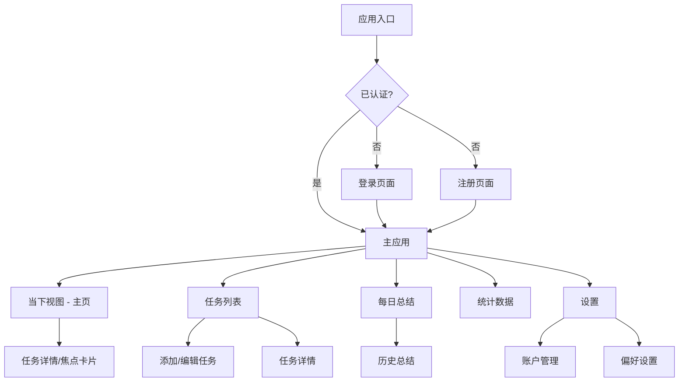
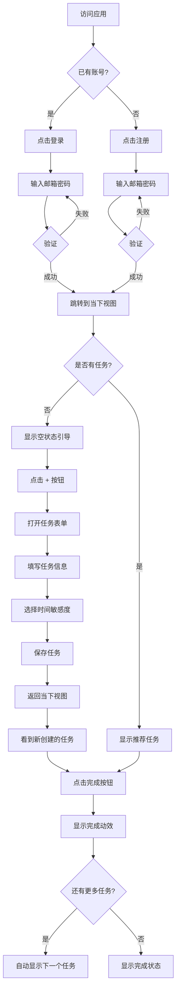
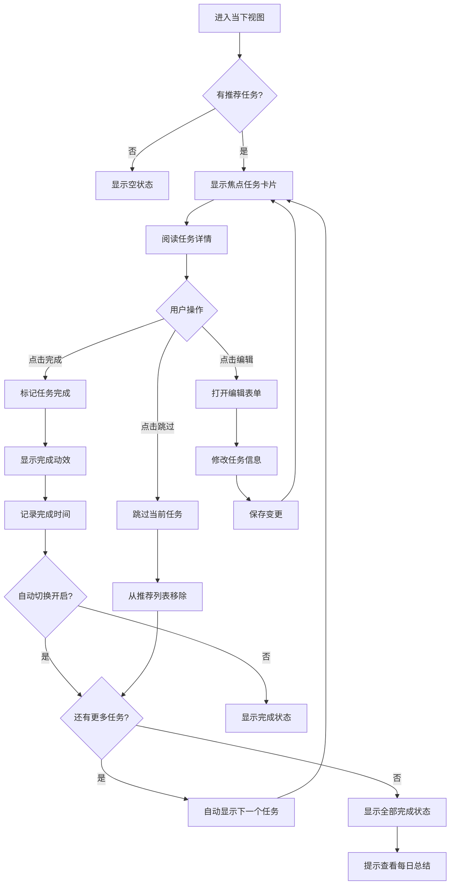

# Focus Flow UI/UX Specification

**Project:** Focus Flow
**Version:** 1.0
**Last Updated:** 2025-11-20
**Author:** Sally (UX Expert) 🎨

---

## Introduction

This document defines the user experience goals, information architecture, user flows, and visual design specifications for Focus Flow's user interface. It serves as the foundation for visual design and frontend development, ensuring a cohesive and user-centered experience.

---

## Overall UX Goals & Principles

### Target User Personas

**主要用户：专注力困难者（Focus-Challenged Professionals）**
- 技术工作者、知识工作者、自由职业者
- 被过多待办事项淹没，难以决定优先级
- 需要明确指引"现在该做什么"而非管理任务列表

**次要用户：效率优化者（Efficiency Optimizers）**
- 已经有良好时间管理习惯的用户
- 寻求通过数据反思优化工作模式
- 重视每日总结和进度可视化

### Usability Goals

1. **极快上手** - 新用户在 3 分钟内完成首个任务创建和完成
2. **零决策疲劳** - "当下视图"让用户无需思考就知道下一步做什么
3. **沉浸式专注** - 单任务焦点模式让用户进入心流状态
4. **持续改进循环** - 每日总结帮助用户反思并优化工作模式
5. **跨设备无缝** - 数据实时同步，切换设备无摩擦

### Design Principles

1. **专注当下 (Focus on Now)** - 不展示"未来待办列表"，只展示"此刻该做什么"
2. **极简至上 (Radical Simplicity)** - 每个屏幕只服务一个核心目标，移除所有干扰
3. **渐进式披露 (Progressive Disclosure)** - 默认最简洁，需要时才展开详情
4. **平静设计 (Calm Design)** - 柔和色彩、轻微动效，避免打断专注状态
5. **即时反馈 (Immediate Feedback)** - 每个操作都有清晰、即时的视觉响应

### Change Log

| Date | Version | Description | Author |
|------|---------|-------------|--------|
| 2025-11-20 | 1.0 | Initial UI/UX specification | Sally (UX Expert) |

---

## Information Architecture (IA)

### Site Map / Screen Inventory

### Navigation Structure

**Primary Navigation (主导航):**
- 固定侧边栏（桌面端）或底部导航栏（移动端）
- 包含 5 个核心页面：
  1. 🎯 当下视图（默认首页）
  2. 📋 任务列表
  3. 📊 每日总结
  4. 📈 统计数据
  5. ⚙️ 设置

**Secondary Navigation:**
- 任务列表页内的时间敏感度分组标签（今天/本周/随时）
- 每日总结页的日期选择器

**Breadcrumb Strategy:**
- MVP 阶段不使用面包屑（应用结构扁平，只有 2 层深度）
- 使用清晰的页面标题和返回按钮替代

---

## User Flows

### Flow 1: 新用户首次使用

**User Goal:** 新用户注册账号并完成第一个任务，体验产品核心价值

**Entry Points:**
- 访问应用首页（未登录状态）
- 从营销页面点击"开始使用"

**Success Criteria:**
- 用户成功注册并登录
- 用户创建至少一个任务
- 用户看到"当下视图"并理解其价值

#### Flow Diagram

#### Edge Cases & Error Handling

- **邮箱已存在**：显示错误提示，建议用户登录或重置密码
- **网络离线**：显示离线提示，数据保存到本地（PWA）
- **表单验证失败**：实时显示错误信息，禁用提交按钮
- **首次使用无引导**：显示空状态卡片，明确说明"点击 + 添加第一个任务"

**Notes:** 考虑添加可跳过的产品导览（onboarding tour）；首次创建任务时可提供示例任务选项快速开始

---

### Flow 2: 完成当下任务流程

**User Goal:** 用户专注完成当前推荐的任务，然后自动进入下一个任务

**Entry Points:**
- 打开应用，直接进入当下视图（默认首页）
- 从任务列表点击任务进入焦点模式

**Success Criteria:**
- 用户成功完成当前任务
- 系统自动记录完成时间
- 自动推荐并显示下一个任务

#### Flow Diagram

#### Edge Cases & Error Handling

- **网络同步失败**：本地先标记完成，后台重试同步
- **任务完成时网络断开**：使用 Service Worker 排队请求
- **用户快速连续完成多个任务**：防抖处理，避免动效重叠
- **所有任务完成**：显示激励性消息和每日总结入口

**Notes:** 完成动效需要轻量（≤500ms），不打断流畅感；考虑添加键盘快捷键（空格键=完成，N=下一个）

---

## Branding & Style Guide

### Visual Identity

**Brand Guidelines:** Focus Flow 采用极简现代风格，强调专注和平静的氛围

### Color Palette

| Color Type | Hex Code | Usage |
|-----------|----------|-------|
| Primary | `#3B82F6` (Blue 500) | 主要按钮、链接、品牌色 |
| Secondary | `#64748B` (Slate 500) | 次要文本、图标 |
| Accent | `#10B981` (Green 500) | 成功状态、完成反馈 |
| Success | `#10B981` (Green 500) | 正向反馈、任务完成 |
| Warning | `#F59E0B` (Amber 500) | 警告、本周任务标识 |
| Error | `#EF4444` (Red 500) | 错误提示、今日紧急任务 |
| Neutral | `#F8FAFC` to `#0F172A` | 背景、边框、文本（Tailwind Slate scale） |

**时间敏感度色彩编码：**
- 🔴 今天必须：`#EF4444` (Red 500) - 紧迫感
- 🟡 本周内：`#F59E0B` (Amber 500) - 中等优先级
- 🔵 随时可做：`#3B82F6` (Blue 500) - 低压力

### Typography

#### Font Families
- **Primary:** `-apple-system, BlinkMacSystemFont, 'Segoe UI', Roboto, sans-serif`
- **Monospace:** `'SF Mono', Monaco, 'Cascadia Code', monospace`

#### Type Scale

| Element | Size | Weight | Line Height |
|---------|------|--------|-------------|
| H1 | `2.25rem` (36px) | 700 | 1.2 |
| H2 | `1.875rem` (30px) | 600 | 1.3 |
| H3 | `1.5rem` (24px) | 600 | 1.4 |
| Body | `1rem` (16px) | 400 | 1.5 |
| Small | `0.875rem` (14px) | 400 | 1.5 |

### Iconography

**Icon Library:** Lucide React (https://lucide.dev)

**Usage Guidelines:**
- 图标尺寸：16px (small), 20px (default), 24px (large)
- 图标颜色：继承文本颜色或使用语义色
- 一致性：同一类型操作使用相同图标

### Spacing & Layout

**Grid System:** Tailwind CSS 默认 12 列网格

**Spacing Scale:** Tailwind 默认间距系统（4px 基准）
- xs: 4px, sm: 8px, md: 16px, lg: 24px, xl: 32px, 2xl: 48px

---

## Component Library / Design System

**Design System Approach:** 使用 **shadcn/ui** 组件库（基于 Radix UI + Tailwind CSS）

### Core Components

已实现的核心组件：

#### Button
**Purpose:** 主要操作按钮
**Variants:** default, destructive, outline, secondary, ghost, link
**States:** default, hover, active, disabled, loading
**Usage Guidelines:** 主要操作使用 default variant，次要操作使用 outline

#### Card
**Purpose:** 内容容器
**Variants:** default, elevated
**Usage Guidelines:** 用于任务卡片、总结卡片等信息分组

#### Dialog
**Purpose:** 模态对话框
**Usage Guidelines:** 用于任务表单、确认删除等需要用户明确确认的操作

#### Toast
**Purpose:** 轻量提示消息
**States:** default, success, error, warning
**Usage Guidelines:** 操作反馈、错误提示，3秒自动消失

#### Tabs
**Purpose:** 内容分组切换
**Usage Guidelines:** 用于每日总结页的"今日/最近7天"切换

#### Switch
**Purpose:** 开关控件
**Usage Guidelines:** 用于设置页面的开关选项

---

## Accessibility Requirements

### Compliance Target

**Standard:** WCAG 2.1 Level AA

### Key Requirements

**Visual:**
- Color contrast ratios: 正文文本 ≥ 4.5:1，大文本 ≥ 3:1
- Focus indicators: 2px solid ring, 高对比度颜色
- Text sizing: 支持浏览器文本缩放至200%

**Interaction:**
- Keyboard navigation: 所有功能可通过 Tab/Enter/Space 操作
- Screen reader support: 语义化 HTML + ARIA labels
- Touch targets: 最小 44x44px（移动端）

**Content:**
- Alternative text: 所有图标和图片提供 aria-label
- Heading structure: 逻辑清晰的 h1-h6 层级
- Form labels: 所有输入框关联 label 元素

### Testing Strategy

- **自动化测试**：使用 axe-core + Playwright 进行可访问性扫描
- **手动测试**：键盘导航测试、屏幕阅读器测试（NVDA/VoiceOver）
- **持续监控**：CI/CD pipeline 集成 a11y 测试

---

## Responsiveness Strategy

### Breakpoints

| Breakpoint | Min Width | Max Width | Target Devices |
|-----------|-----------|-----------|----------------|
| Mobile | `320px` | `767px` | iPhone SE, Android phones |
| Tablet | `768px` | `1023px` | iPad, Android tablets |
| Desktop | `1024px` | `1279px` | Laptops |
| Wide | `1280px` | - | Desktop monitors, iMac |

### Adaptation Patterns

**Layout Changes:**
- Mobile: 单列布局，全屏模式
- Tablet: 2 列布局（列表+详情）
- Desktop: 侧边栏 + 主内容区

**Navigation Changes:**
- Mobile: 底部导航栏（5 个图标）
- Desktop: 固定左侧边栏（展开文字）

**Content Priority:**
- Mobile: 隐藏次要信息，专注核心内容
- Desktop: 显示更多上下文信息

**Interaction Changes:**
- Mobile: 触摸手势（滑动、长按）
- Desktop: 鼠标悬停、键盘快捷键

---

## Animation & Micro-interactions

### Motion Principles

1. **性能优先** - 只动画 transform 和 opacity 属性
2. **快速响应** - 交互反馈 < 100ms
3. **尊重用户偏好** - 支持 prefers-reduced-motion
4. **有目的性** - 动画传达意义而非装饰

### Key Animations

- **任务完成**：淡出 + 向上滑动（500ms, ease-out）
- **页面切换**：淡入淡出（200ms, ease-in-out）
- **加载状态**：脉冲动画（1.5s, ease-in-out, infinite）
- **Toast 通知**：滑入滑出（300ms, ease-out）
- **按钮点击**：轻微缩放（100ms, ease-out）

---

## Performance Considerations

### Performance Goals

- **Page Load:** FCP < 1.5s, LCP < 2.5s (3G网络)
- **Interaction Response:** < 100ms 至视觉反馈
- **Animation FPS:** 保持 60fps

### Design Strategies

- **图片优化**：使用 WebP 格式，lazy loading
- **代码分割**：路由级别代码分割
- **缓存策略**：Service Worker 缓存静态资源
- **减少重绘**：避免布局抖动，使用 CSS transform

---

## Next Steps

### Immediate Actions

1. 与开发团队 review 本规范，确认技术可行性
2. 在 Figma 创建高保真设计稿（基于本规范）
3. 开发团队开始前端架构设计
4. 进行首批用户可用性测试

### Design Handoff Checklist

- [x] All user flows documented
- [x] Component inventory complete
- [x] Accessibility requirements defined
- [x] Responsive strategy clear
- [x] Brand guidelines incorporated
- [x] Performance goals established

---

**Document Status:** ✅ Complete - Ready for Development

